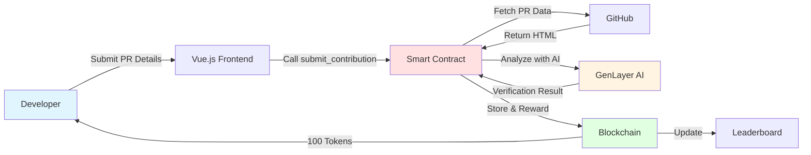
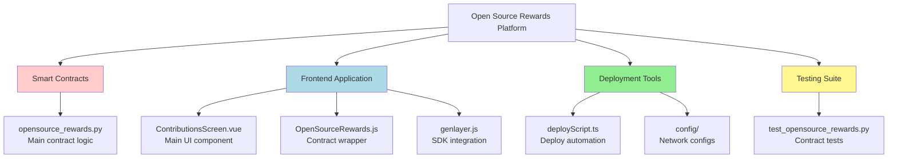
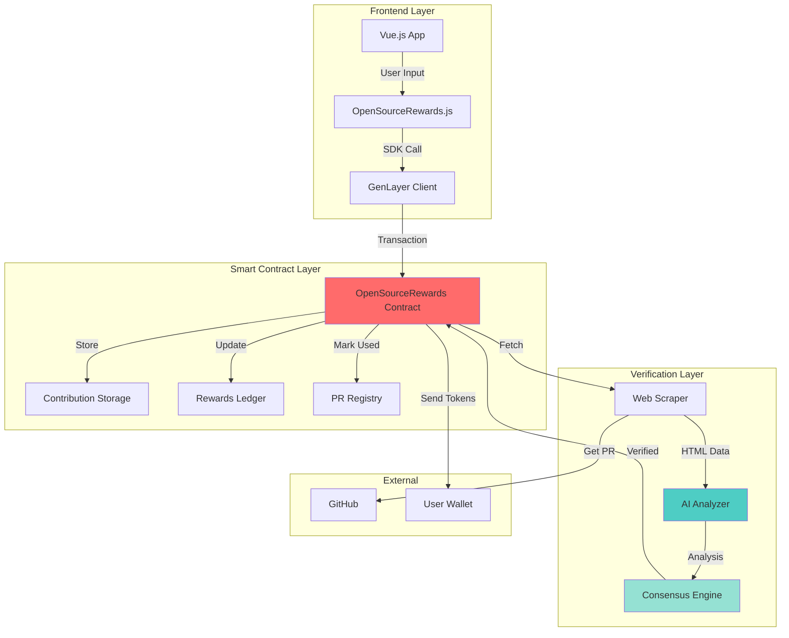
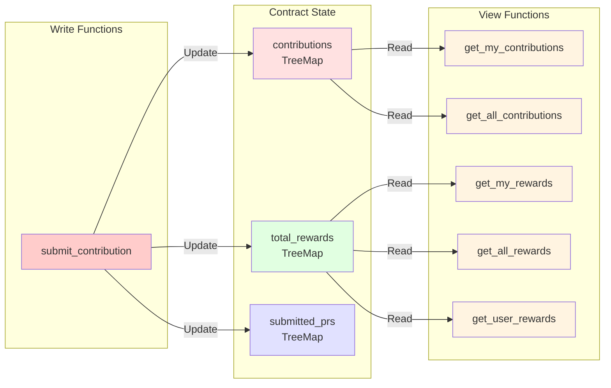
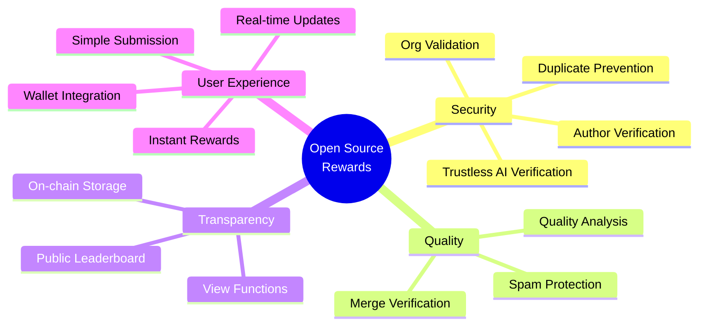

# Open Source Rewards Platform 🎁
[](https://opensource.org/license/mit/)
[](https://discord.gg/8Jm4v89VAu)
[](https://t.me/genlayer)
[](https://x.com/GenLayer)

> **Reward open source contributors automatically using AI-powered verification on GenLayer**

## ⚡ Quick Start

```bash
# 1. Deploy the contract
genlayer network          # Select network (studionet recommended)
genlayer deploy          # Deploy OpenSourceRewards contract

# 2. Configure frontend
cd app
cp .env.example .env     # Add your contract address
npm install
npm run dev              # Start at http://localhost:5173

# 3. Submit a contribution
# Visit the app, connect wallet, and submit your merged PR details
```

## 👀 About
Get rewarded for your open source contributions! This platform uses GenLayer's intelligent contracts with AI verification to automatically reward developers for their merged pull requests to legitimate open source projects.

**How it works:**
1. Submit your merged PR details (GitHub username, organization, project, repo URL, PR number)
2. The AI-powered smart contract verifies:
   - ✅ PR is merged
   - ✅ PR author matches your GitHub username
   - ✅ Organization name matches repository owner
   - ✅ Project name matches repository name
   - ✅ Contribution is not spam or low-quality
   - ✅ PR hasn't been claimed before
3. Receive **100 tokens** instantly for each verified contribution
4. Track your rewards on the leaderboard



**Default Configuration:**
- **Reward per contribution:** 100 tokens
- **Eligible contributions:** Merged pull requests only
- **Submission limit:** Unlimited (but each PR can only be claimed once)
- **Verification method:** AI-powered consensus via GenLayer
- **Contract location:** `contracts/opensource_rewards.py`
- **Frontend:** Vue.js app in `/app` folder

## 📦 What's included



- **Smart Contract:** `contracts/opensource_rewards.py` - AI-powered intelligent contract for contribution verification
- **Frontend App:** Vue.js application in `/app` folder with:
  - Wallet connection
  - Contribution submission form
  - Live leaderboard
  - Personal rewards dashboard
  - All contributions history
- **Deploy Script:** TypeScript deployment automation in `/deploy`
- **Tests:** Comprehensive test suite in `/test`
- **Contract Logic:** JavaScript wrapper classes in `/app/src/logic`

## 🛠️ Requirements
- A running GenLayer Studio (Install from [Docs](https://docs.genlayer.com/developers/intelligent-contracts/tooling-setup#using-the-genlayer-studio) or work with the hosted version of [GenLayer Studio](https://studio.genlayer.com/)). If you are working locally, this repository code does not need to be located in the same directory as the Genlayer Studio.
- [GenLayer CLI](https://github.com/genlayerlabs/genlayer-cli) globally installed. To install or update the GenLayer CLI run `npm install -g genlayer`

## 🚀 Steps to run this platform

```mermaid
graph LR
    A[1. Deploy Contract] -->|genlayer deploy| B[2. Configure Frontend]
    B -->|Set .env vars| C[3. Install Dependencies]
    C -->|npm install| D[4. Run Dev Server]
    D -->|npm run dev| E[5. Open Browser]
    E -->|localhost:5173| F[6. Connect Wallet]
    F --> G[7. Submit Contributions]

    style A fill:#ffcccb
    style B fill:#add8e6
    style C fill:#90ee90
    style D fill:#fff68f
    style E fill:#dda0dd
    style F fill:#f0e68c
    style G fill:#98fb98
```



### 1. Deploy the contract
   Deploy the contract from `/contracts/opensource_rewards.py` using the GenLayer CLI:
   1. Choose the network that you want to use (studionet, localnet, or tesnet-*): `genlayer network`
   2. Execute the deploy command `genlayer deploy`. This command is going to execute the deploy script located in `/deploy/deployScript.ts`

### 2. Setup the frontend environment
  1. All the content of the dApp is located in the `/app` folder.
  2. Copy the `.env.example` file in the `app` folder and rename it to `.env`, then fill in the values for your configuration. The provided VITE_STUDIO_URL value is the backend of the hosted GenLayer Studio.
  3. Add the deployed contract address to the `/app/.env` under the variable `VITE_CONTRACT_ADDRESS`

### 3. Run the frontend Vue app
   Execute the following commands in your terminal:
   ```shell
   cd app
   npm install
   npm run dev
   ```
   The terminal should display a link to access your frontend app (usually at http://localhost:5173/).

   **Frontend Features:**
   - Connect/disconnect wallet
   - Submit contributions with 5-field form
   - View all contributions (yours and others)
   - Track personal reward balance
   - See leaderboard rankings
   - Real-time updates after submission

   For more information on the code see [GenLayerJS](https://github.com/yeagerai/genlayer-js).

### 4. Test contracts
1. Install the Python packages listed in the `requirements.txt` file in a virtual environment.
2. Make sure your GenLayer Studio is running. Then execute the following command in your terminal:
   ```shell
   gltest
   ```

## 💡 How the Open Source Rewards Contract Works

The OpenSourceRewards contract uses GenLayer's intelligent contract capabilities to verify and reward open source contributions:

### System Architecture



### 1. Submitting Contributions
   Users submit contributions by providing **5 required fields**:
   - **GitHub Username**: Your GitHub account name (must match PR author)
   - **Organization**: Repository owner/organization (e.g., "facebook", "vercel")
   - **Project Name**: Repository name (e.g., "react", "next.js")
   - **Repository URL**: Full GitHub URL (e.g., "https://github.com/facebook/react")
   - **PR Number**: The pull request number (e.g., "12345")

   The contract prevents duplicate submissions globally across all users.

### 2. AI-Powered Verification Process
   The intelligent contract uses GenLayer's AI capabilities to verify each contribution:

```mermaid
sequenceDiagram
    participant U as User
    participant F as Frontend
    participant SC as Smart Contract
    participant GH as GitHub
    participant AI as GenLayer AI
    participant BC as Blockchain

    U->>F: Submit PR Details
    F->>SC: submit_contribution(username, org, project, url, pr_num)

    Note over SC: Check PR not claimed
    SC->>SC: Check submitted_prs registry

    SC->>GH: Fetch PR page
    GH-->>SC: HTML content

    SC->>AI: Analyze PR data
    Note over AI: Extract: author, org,<br/>project, merge status,<br/>spam detection
    AI-->>SC: Verification results

    alt All checks pass
        SC->>SC: Validate author match
        SC->>SC: Validate org match
        SC->>SC: Validate project match
        SC->>SC: Check not spam
        SC->>SC: Store contribution
        SC->>SC: Mark PR as claimed
        SC->>BC: Award 100 tokens
        BC-->>U: Tokens received ✅
        SC-->>F: Success
        F-->>U: Contribution verified!
    else Verification fails
        SC-->>F: Error message
        F-->>U: Submission rejected ❌
    end
```



   **Step 1:** Fetch PR data from GitHub
   - Constructs PR URL: `{repo_url}/pull/{pr_number}`
   - Renders the GitHub page using `gl.nondet.web.render()`

   **Step 2:** AI Analysis
   - Extracts PR metadata (author, merge status, organization, project)
   - Validates against submitted data
   - Detects spam/low-quality contributions

   **Step 3:** Verification Checks
   - ✅ PR is merged (not open/closed)
   - ✅ PR author matches claimed username (case-insensitive)
   - ✅ Organization matches repository owner
   - ✅ Project name matches repository name
   - ✅ Not flagged as spam
   - ✅ PR not previously claimed

   **Step 4:** Consensus
   - Uses `gl.eq_principle.strict_eq()` to reach consensus across validators
   - Ensures verification is trustless and decentralized

### 3. Automated Reward Distribution
   - **Default reward:** 100 tokens per verified contribution
   - **Configurable:** Set `rewardPerContribution` in `/deploy/deployScript.ts`
   - **Instant payout:** Rewards added to user balance immediately after verification
   - **Tracking:** Total rewards tracked per wallet address
   - **Immutable:** All contributions stored permanently on-chain

### 4. Leaderboard & Tracking Features



   **View Functions (no gas cost):**
   - `get_my_contributions()`: Your submitted contributions
   - `get_all_contributions()`: All verified contributions from all users
   - `get_my_rewards()`: Your total reward balance
   - `get_user_rewards(address)`: Rewards for any wallet address
   - `get_all_rewards()`: Complete leaderboard (sorted by rewards)
   - `get_reward_per_contribution()`: Current reward amount per PR

### Key Features:



- 🤖 **Trustless Verification**: AI validates contributions without manual review or admin approval
- 🚫 **Duplicate Prevention**: Global registry ensures each PR can only be claimed once across all users
- 👤 **Author Verification**: Cryptographically ensures claimants actually created the PRs
- 🛡️ **Organization Validation**: Verifies org and project names to prevent fake submissions
- 🗑️ **Spam Protection**: AI analyzes PR quality and filters out spam/test contributions
- 🌐 **Transparent**: All contributions and rewards are publicly visible on-chain
- ⚡ **Instant Rewards**: Tokens distributed immediately after verification
- 📊 **Leaderboard**: Real-time ranking of top contributors

## 🎯 Contribution Requirements

```mermaid
flowchart TD
    Start([User Submits PR]) --> Check1{PR Merged?}
    Check1 -->|No| Reject1[❌ Reject: PR not merged]
    Check1 -->|Yes| Check2{Author Matches?}
    Check2 -->|No| Reject2[❌ Reject: Wrong author]
    Check2 -->|Yes| Check3{Org Matches?}
    Check3 -->|No| Reject3[❌ Reject: Wrong organization]
    Check3 -->|Yes| Check4{Project Matches?}
    Check4 -->|No| Reject4[❌ Reject: Wrong project]
    Check4 -->|Yes| Check5{Not Spam?}
    Check5 -->|Spam| Reject5[❌ Reject: Spam detected]
    Check5 -->|Valid| Check6{Not Claimed?}
    Check6 -->|Already claimed| Reject6[❌ Reject: Already claimed]
    Check6 -->|Available| Success[✅ Award 100 Tokens]

    style Start fill:#e1f5ff
    style Success fill:#e1ffe1
    style Reject1 fill:#ffe1e1
    style Reject2 fill:#ffe1e1
    style Reject3 fill:#ffe1e1
    style Reject4 fill:#ffe1e1
    style Reject5 fill:#ffe1e1
    style Reject6 fill:#ffe1e1
```



To earn rewards, your pull request must meet **ALL** requirements:

| Requirement | Description | Verified By |
|-------------|-------------|-------------|
| ✅ **Merged** | PR must be merged (not just open/closed) | AI checks merge status |
| ✅ **Author Match** | PR author must match your GitHub username | AI compares author field |
| ✅ **Organization Match** | Repository owner must match claimed org | AI validates repo owner |
| ✅ **Project Match** | Repository name must match claimed project | AI validates repo name |
| ✅ **Not Spam** | Contribution must be legitimate/quality | AI analyzes PR content |
| ✅ **Not Claimed** | PR hasn't been submitted before by anyone | Contract checks global registry |

**Example Valid Submission:**

```mermaid
graph TD
    A[User Input] --> B[GitHub Username: johndoe]
    A --> C[Organization: facebook]
    A --> D[Project Name: react]
    A --> E[Repository URL:<br/>github.com/facebook/react]
    A --> F[PR Number: 12345]

    B --> G{AI Verification}
    C --> G
    D --> G
    E --> G
    F --> G

    G -->|Check 1| H[✓ PR is merged]
    G -->|Check 2| I[✓ Author = johndoe]
    G -->|Check 3| J[✓ Org = facebook]
    G -->|Check 4| K[✓ Project = react]
    G -->|Check 5| L[✓ Not spam]
    G -->|Check 6| M[✓ Not claimed]

    H --> N[All Checks Pass]
    I --> N
    J --> N
    K --> N
    L --> N
    M --> N

    N --> O[💰 Award 100 Tokens]

    style A fill:#e1f5ff
    style G fill:#fff4e1
    style N fill:#e1ffe1
    style O fill:#90ee90
```



- GitHub Username: `johndoe`
- Organization: `facebook`
- Project Name: `react`
- Repository URL: `https://github.com/facebook/react`
- PR Number: `12345`

The AI will verify that PR #12345 in facebook/react is:
- Merged ✓
- Created by @johndoe ✓
- In the facebook/react repository ✓
- Not spam ✓
- Not previously claimed ✓

## 🧪 Tests

This project includes comprehensive integration tests in `/test/test_opensource_rewards.py` that interact with the contract deployed in GenLayer Studio.

**Test Coverage:**

| Test | Description | Validates |
|------|-------------|-----------|
| `test_submit_contribution` | Submit a valid merged PR | End-to-end submission flow |
| `test_get_reward_per_contribution` | Query reward amount | Contract initialization |
| `test_get_my_rewards_initial` | Check initial user balance | Default state is 0 |
| `test_get_all_rewards` | Fetch leaderboard data | Leaderboard functionality |
| `test_get_all_contributions` | Query all contributions | Data retrieval |
| `test_duplicate_submission_prevention` | Try claiming same PR twice | Duplicate prevention |
| `test_get_user_rewards` | Get rewards for specific address | User balance queries |

**Running Tests:**
```bash
# Install dependencies
pip install -r requirements.txt

# Make sure GenLayer Studio is running
# Then run tests
gltest
```

**Note:** Some tests require real GitHub PRs. Update test data with actual merged PRs for full integration testing.

## 🔧 Configuration

### Reward Amount
Configure the reward amount in `/deploy/deployScript.ts` **before** deploying:

```typescript
// Default: 100 tokens per contribution
const rewardPerContribution = 100;

// For higher rewards:
const rewardPerContribution = 500;

// For lower rewards:
const rewardPerContribution = 50;
```

**Important:** The reward amount is set at deployment and cannot be changed later. Redeploy the contract to change rewards.

### Network Selection
Choose your network before deployment:
```bash
genlayer network
```

Options:
- **studionet** - Hosted GenLayer Studio (recommended for testing)
- **localnet** - Local GenLayer instance
- **testnet** - GenLayer testnet

### Environment Variables
Configure in `/app/.env`:
```env
VITE_CONTRACT_ADDRESS=your_deployed_contract_address
VITE_STUDIO_URL=https://studio.genlayer.com  # Or your custom endpoint
```

## 💬 Community
Connect with the GenLayer community to discuss, collaborate, and share insights:
- **[Discord Channel](https://discord.gg/8Jm4v89VAu)**: Our primary hub for discussions, support, and announcements.
- **[Telegram Group](https://t.me/genlayer)**: For more informal chats and quick updates.

Your continuous feedback drives better product development. Please engage with us regularly to test, discuss, and improve GenLayer.

## 📖 Documentation
For detailed information on how to use GenLayerJS SDK, please refer to our [documentation](https://docs.genlayer.com/).

## 📜 License
This project is licensed under the MIT License - see the LICENSE file for details.
